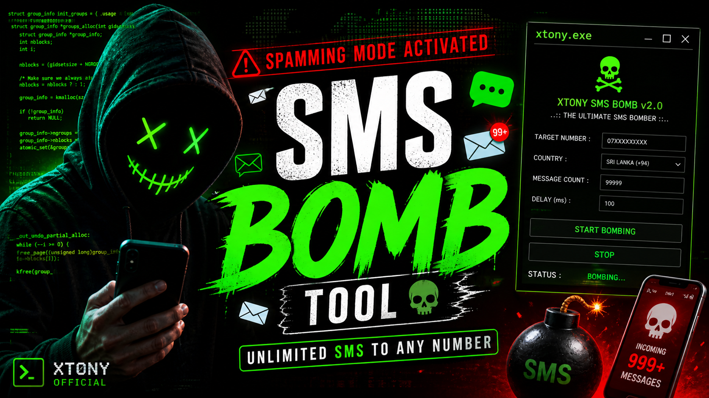

# SMS BOMB v3.0 [ELITE]

A modular, high-performance SMS Bombing framework designed for testing and learning purposes. This tool targets specific Sri Lankan services to demonstrate how automated registration and OTP flows work.

## ⚠️ Disclaimer

**FOR EDUCATIONAL AND FUN PURPOSES ONLY.**

The developer (`xtony.exe`) is **NOT responsible** for any illegal activities done using this tool. SMS bombing can be considered harassment or a violation of service terms. Use this tool **responsibly** and only on phone numbers you own or have explicit permission to test. This project was created to understand API interactions and terminal UI design in Python.

---

## 🚀 Features

- **Modular Design**: Easily add or remove service modules.
- **Concurrent Execution**: Fast, threaded bombing engine.
- **Rich Terminal UI**: Animated banners, dynamic menus, and live dashboards.
- **Themes**: Multiple color schemes (`neon`, `hacker`, `stealth`, `blood`).
- **Configurable**: Saves your preferences automatically.

## 🛠️ Installation

1. Clone the repository:
   ```bash
   git clone https://github.com/yourusername/sms-bomb.git
   cd sms-bomb
   ```

2. Install dependencies:
   ```bash
   pip install -r requirements.txt
   ```

## 📖 Usage

### Option 1: Run from Source (Recommended for Devs)
1. Install dependencies: `pip install -r requirements.txt`
2. Run: `python bomb.py`

### Option 2: Pre-built Executable (Windows)
1. Go to the `dist/` folder.
2. Run `SMS_BOMB.exe`. No Python installation is required!

### Attack Profiles
- **Light**: 10 messages, 2s delay (1 Service)
- **Medium**: 50 messages, 1s delay (2 Services)
- **Heavy**: 100 messages, 0.5s delay (All Services)

## 🔧 Architecture

- `bomb.py`: Main entry point.
- `core/`: Engine, configuration, and utilities.
- `services/`: SMS service modules (eChannelling, SLT).
- `ui/`: Banner, menus, dashboard, and themes.

---
**Developer:** xtony.exe  
**Version:** 3.0  
**Status:** STABLE
